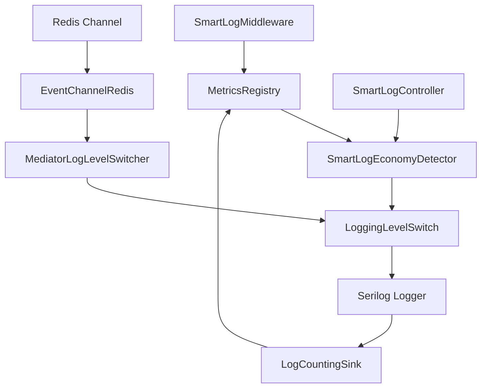
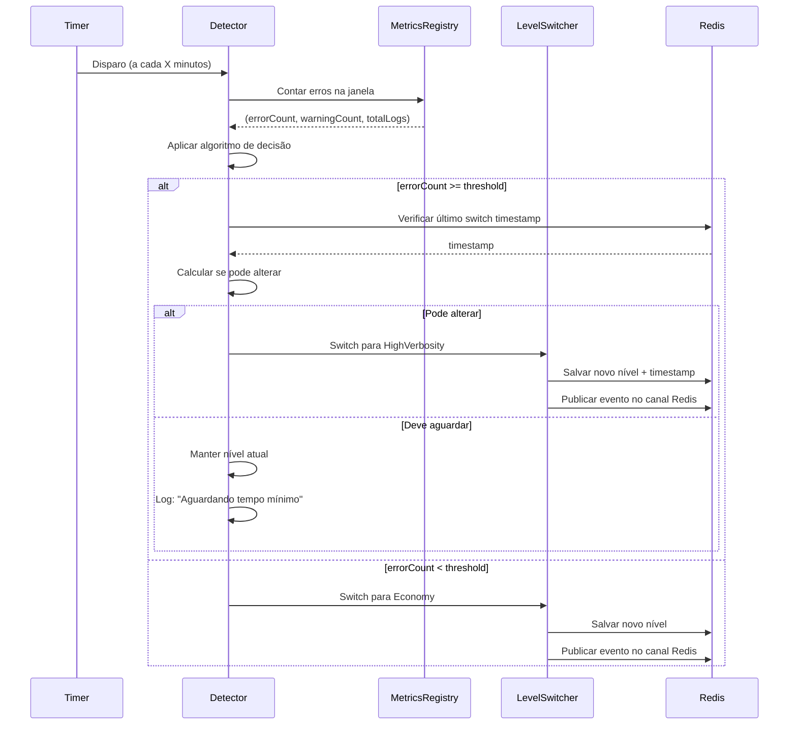

# 📚 **DOCUMENTAÇÃO COMPLETA (v1.0.0)**

> **Sistema de Logging Adaptativo para .NET 8+**  
> *Ajusta automaticamente a verbosidade de logs com base em métricas de erro em tempo real*

> **Versão:** 1.0.0 &nbsp;|&nbsp; **Última atualização:** Setembro 2025

---

## 🧭 **Sumário Rápido**
- [Visão Geral](#🎯-visão-geral)
- [Comparativo de Configurações](#🔄-comparativo-de-configurações)
- [Notes de Versão](#📝-notes-de-versão)
- [Por que usar Intelligent Logging?](#🚀-por-que-usar-intelligent-logging)
- [Compatibilidade](#🖥️-compatibilidade)
- [Checklist de Implementação Rápida](#✅-checklist-de-implementação-rápida)
- [Arquitetura Principal](#🏗️-arquitetura-principal)
- [Configuração e Exemplos](#📦-configuração-e-exemplos)
- [Guia de Implementação](#🚀-guia-de-implementação)
- [API de Controle](#🎮-api-de-controle)
- [Por que Structured Logging?](#🤔-por-que-structured-logging)
- [Algoritmo de Detecção](#⚙️-algoritmo-de-detecção)
- [Roadmap](#🎯-roadmap)
---
## 🎯 **VISÃO GERAL**
O **Smart Logging** é uma SDK que implementa um sistema de logging adaptativo que ajusta automaticamente os níveis de verbosidade baseado na saúde da aplicação. Quando detecta anomalias (como picos de erro), aumenta temporariamente o detalhamento dos logs para facilitar o diagnóstico.

- **High Verbosity Mode**: Ativa logs detalhados (Debug/Information) quando detecta problemas
- **Buffer Circular**: Sistema de métricas otimizado para alta performance
- **🎮 API de Controle**: Endpoints REST para consulta, alteração manual e teste dos níveis de log em tempo real.
- **🚦 Algoritmo de Decisão Adaptativo**: Ajuste automático do nível de log com base em thresholds, tempo mínimo, janela temporal e análise de padrões de erro.
- **💡 Exemplos Práticos**: Diversos cenários de uso (API, Worker, Bancário, Alta Performance, Microserviços, etc) e exemplos de configuração em C# e JSON.
---

## 🔄 **Comparativo de Configurações**
| Aspecto | Serilog Tradicional | Smart Logging |
|---------|-------------------|-------------------|
| **Nível de Log** | Fixo (ex: Warning) | Adaptativo (Warning ↔ Information) |
| **Configuração** | `MinimumLevel.Warning()` | `EconomyLevel = Warning`, `HighVerbosityLevel = Information` |
| **Redis** | `Configuração distribuída para todas as possíveis pods de uma aplicação` |
| **Trigger** | Manual | Automático por erro |
| **Custo** | Constante | Variável (reduzido) |
| **Observabilidade** | Limitada | Métricas |


## Uso obrigatório do REDIS.
- O uso do redis é de extrema importancia para que a alteração de verbosidade seja propagada para todas as possíveis pods de uma aplicação.

---

## 📝 **Notes de Versão**
| Versão | Data         | Mudanças/Relevância                       |
|--------|--------------|-------------------------------------------|
| 1.0.1  | Set/2025     | Gerenciamento de níveis de log para dev/tst/staging |

---

## 🚀 **Por que usar Smart Logging?**
- Ajuste automático da verbosidade dos logs conforme saúde da aplicação
- Redução de custos operacionais e de armazenamento
- Diagnóstico facilitado em cenários críticos
- Integração nativa com Redis para orquestração multi-serviço
- API de monitoramento pronta para observabilidade

---

## 🖥️ **Compatibilidade**
| Tecnologia         | Versão Mínima | Observação                |
|--------------------|---------------|--------------------------|
| .NET               | 8.0           | Recomendado >= 8.0       |
| Serilog            | 3.0           | Logging principal        |
| Redis              | 5.0           | Opcional, para sync      |
| ASP.NET Core       | 8.0+          | Web API/MVC/Worker      |

---

## ✅ **Checklist de Implementação Rápida**
- [x] Instale o pacote `SmartLog.Core`
- [x] Configure o `SmartLogOptions` para seu ambiente
- [x] Configure Serilog conforme exemplos
- [x] (OBRIGATORIO) Configure Redis para sincronização
- [x] Teste endpoints de status e métricas
- [x] Valide logs e switches automáticos
- [x] Implemente monitoramento e alertas sugeridos

```

**Explicação dos principais campos:**
| Campo                          | Descrição                                                                                       | Exemplo de Uso / Valor Típico                | Enum / Observação |
|-------------------------------|-------------------------------------------------------------------------------------------------|----------------------------------------------|-------------------|
| CircularBufferSize            | Histórico de métricas mantido em memória (quantidade máxima de eventos no buffer circular)       | 1000 (dev), 5000 (prod), 500 (baixo volume)  | int               |
| EconomyLevel                  | Nível de log padrão quando o sistema está saudável                                               | Error, Warning                              | LogEventLevel     |
| HighVerbosityLevel            | Nível detalhado ativado quando há muitos erros                                                   | Information, Debug                          | LogEventLevel     |
| DetectionInterval             | Intervalo entre cada detecção automática de anomalias                                            | "00:00:30" (dev), "00:05:00" (prod)        | TimeSpan          |
| MinimumHighVerbosityDurationInMinute | Tempo mínimo em modo detalhado antes de retornar ao modo econômico                      | 1 (dev), 30 (prod)                          | int (minutos)     |
| AbsoluteErrorThreshold        | Quantidade absoluta de erros para disparar modo detalhado                                        | 15 (dev), 50 (prod), 5 (baixo volume)        | int               |
| LogWindowSeconds              | Janela temporal (em segundos) para contagem dos erros                                            | 60 (dev), 300 (prod)                        | int (segundos)    |
| EnableRedisChannelListener    | Permite comandos externos via Redis para sincronização de nível de log entre instâncias          | true (prod), false (dev)                    | bool              |
| LoadWorkerSincronizedInMinute | Intervalo de sincronização do worker de log via Redis                                            | 5                                           | int (minutos)     |

**Documentação dos Enums:**

`LogEventLevel` (Serilog):
| Valor        | Significado                |
|--------------|---------------------------|
| Verbose (0)  | Log detalhado para debug   |
| Debug (1)    | Log de depuração           |
| Information (2) | Informações gerais      |
| Warning (3)  | Avisos                    |
| Error (4)    | Erros                     |
| Fatal (5)    | Erros críticos            |

**Exemplo prático de configuração:**
```json
{
    "CircularBufferSize": 1000,
    "EconomyLevel": "Error", //Ou Warning
    "HighVerbosityLevel": "Information",
    "DetectionInterval": "00:00:30",
    "MinimumHighVerbosityDurationInMinute": 1,
    "AbsoluteErrorThreshold": 15,
    "LogWindowSeconds": 60,
    "EnableRedisChannelListener": true,
    "LoadWorkerSincronizedInMinute": 5
}

```

**Observação importante channel redis:**
 - O smartLog identifica sua aplicação por reflexão para criar um canal único de sua aplicação no redis.

**Boas práticas:**
- Crie seções diferentes para cada ambiente (`smartLogEconomy-dev`, `smartLogEconomy-prd`, etc).
- O redis já obtém as váriaveis de ambiente por default das secrets do mesmo BB do redis.
- Ajuste os thresholds conforme o perfil da aplicação (alta/baixa criticidade).


### **🧠 SmartLogEconomyDetector - Motor de Decisão**

Algoritmo simples baseado em contagem de erros na janela temporal.

```csharp
if (errorCount >= options.AbsoluteErrorThreshold)
    return new SmartLogDecision { ShouldSwitchToHighVerbosity = true, ... };
else
    return new SmartLogDecision { ShouldSwitchToHighVerbosity = false, ... };
```

Proteções: Tempo mínimo para evitar flapping (apenas diminuição respeita tempo).

### **🧮 LogCountingSink - Interceptador de Eventos**

Sink customizado do Serilog que registra eventos no MetricsRegistry, independente do filtro de nível.

### **🔄 MediatorLogLevelSwitcher - Orquestrador de Mudanças**

Gerencia switches locais e sincronização via Redis com TTL.

---

## 🏗️ **ARQUITETURA PRINCIPAL**



**Fluxo:**
1. Middleware intercepta requests e registra métricas.
2. Detector analisa padrões de erro.
3. Switch altera verbosidade em tempo real.
4. Redis sincroniza mudanças entre serviços.

**Boas práticas:**
- Seções diferentes para cada ambiente
- Variáveis de ambiente para segredos
- Thresholds ajustados conforme criticidade

### 🧠 **SmartLogEconomyDetector - Motor de Decisão**
Algoritmo simples baseado em contagem de erros na janela temporal.
```csharp
if (errorCount >= options.AbsoluteErrorThreshold)
    return new SmartLogDecision { ShouldSwitchToHighVerbosity = true, ... };
else
    return new SmartLogDecision { ShouldSwitchToHighVerbosity = false, ... };
```
Proteções: Tempo mínimo para evitar flapping.

### 🧮 **LogCountingSink - Interceptador de Eventos**
Sink customizado do Serilog que registra eventos no MetricsRegistry, independente do filtro de nível.

### 🔄 **MediatorLogLevelSwitcher - Orquestrador de Mudanças**
Gerencia switches locais e sincronização via Redis com TTL.

---

## 📦 **CONFIGURAÇÃO E EXEMPLOS**
### 1️⃣ **Instalação**
```powershell
dotnet add package Intelligent.Logging.Core --source IntelligentLogging
```

### 2️⃣ **Cenários Representativos**
- API Web Padrão
- Microserviços
- Alto Volume
- Baixo Volume
- Worker/Background
- Alta Performance
- Baixa Latência
- Balanceado

Exemplos detalhados disponíveis em [CENÁRIOS-USO-AVANCADOS.md](CENARIOS-USO.md)

---

## 🚀 **GUIA DE IMPLEMENTAÇÃO**

### **1️⃣ Instalação Completa**

```powershell
# Adicionar fonte local (uma vez só)
dotnet nuget add source c:\InteligentLogging\packages --name "IntelligentLogging"

# Instalar pacote
dotnet add package Intelligent.Logging.Core --source IntelligentLogging

# Atualizar versão
dotnet add package Intelligent.Logging.Core --version 1.0.1 --source IntelligentLogging
```

### **3️⃣ Configurações por Ambiente**

#### **🔧 Desenvolvimento**
```csharp
builder.Services.AddSmartLogEconomy(builder.Configuration, config =>
    config.ForDevelopment(
        economy: LogEventLevel.Information,           // Mais verboso
        highVerbosity: LogEventLevel.Debug,
        detectionInterval: TimeSpan.FromSeconds(15),  // Detecção rápida
        logWindowSeconds: 60,
        absoluteErrorThreshold: 3,                    // Menos tolerante
        minimumHighVerbosityDurationInMinute: 2,
        enableRedis: false                            // Redis opcional
    )
);
```

#### **🏭 Produção**
```csharp
builder.Services.AddSmartLogEconomy(builder.Configuration, config =>
    config.ForProduction(
        economy: LogEventLevel.Error,                 // Economia máxima
        highVerbosity: LogEventLevel.Information,
        detectionInterval: TimeSpan.FromMinutes(5),   // Detecção moderada
        logWindowSeconds: 300,
        absoluteErrorThreshold: 50,                   // Mais tolerante
        minimumHighVerbosityDurationInMinute: 30,     // Estabilidade
        enableRedis: true                             // Redis obrigatório
    )
);
```

### **4️⃣ Cenários Práticos de Implementação**
#### **Cenário 1: API Web (Desenvolvimento vs Produção)**

```csharp
builder.Services.AddSmartLogEconomy(builder.Configuration, config =>
{
    if (builder.Environment.IsProduction())
    {
        config.ForProduction(LogEventLevel.Error, LogEventLevel.Information, 
                           TimeSpan.FromMinutes(5), 300, 50, 30, true);
    }
    else
    {
        config.ForDevelopment(LogEventLevel.Information, LogEventLevel.Debug,
                            TimeSpan.FromSeconds(30), 60, 5, 2, false);
    }
});

app.UseSmartLogEconomy();
```

#### **Cenário 3: Alta Performance/Microserviços*

> **📖 Mais exemplos:** Para cenários específicos como Workers, Elasticsearch, DataDog, consulte [CENÁRIOS-USO-AVANCADOS.md](CENARIOS-USO.md)

## 🎮 **API DE CONTROLE**
### 📊 **Monitoramento**
- `GET /api/smart-logs/status`: Nível atual e última decisão
- `GET /api/smart-logs/metrics`: Métricas detalhadas

### 🎛️ **Controle Manual**
- `POST /api/smart-logs/level`: Alterar nível com tempo de expiração
---

> **Logging estruturado para máxima eficiência e observabilidade**

### **🤔 Por que Structured Logging?**

| Aspecto | Logging Tradicional | Structured Logging |
|---------|-------------------|-------------------|
| **Formato** | Texto livre | JSON/Structured |
| **Consulta** | Grep/Text search | SQL-like queries |
| **Análise** | Manual | Automatizada |
| **Observabilidade** | Limitada | Rica |


### **🎯 Padrões Essenciais**
### **🚫 Anti-Patterns Críticos**

```csharp
// ❌ NUNCA logar dados sensíveis
_logger.LogInformation("Login", new { Password = password }); // NUNCA!

// ✅ Logar de forma segura
_logger.LogInformation("Login attempt", new { Username = username });

// ❌ Evitar concatenação
_logger.LogInformation($"User {username} logged in at {DateTime.Now}");

// ✅ Usar estrutura
_logger.LogInformation("User login", new { Username = username, LoginAt = DateTime.UtcNow });
```

> **📖 Padrões Avançados:** Para middleware de contexto, correlation ID e integração com APM, consulte [LOGGING-ESTRUTURADOS.md](LOGGING-ESTRUTURADOS.md)

---

## ⚙️ **ALGORITMO DE DETECÇÃO**

> **Funcionamento interno do motor de decisão inteligente**

### **🧮 Lógica de Decisão Simplificada**

```
┌─────────────────────────────────────────────┐
│ ALGORITMO DE ECONOMIA INTELIGENTE           │
├─────────────────────────────────────────────┤
│ 1. Conta erros na janela temporal          │
│ 2. Compara com threshold configurado       │
│ 3. Decide nível recomendado                │
│ 4. Verifica restrições de tempo mínimo     │
│ 5. Executa mudança se necessário           │
└─────────────────────────────────────────────┘

IF (errorCount >= AbsoluteErrorThreshold) THEN
    recommendedLevel = HighVerbosityLevel
    reason = "Error threshold exceeded"
ELSE
    recommendedLevel = EconomyLevel  
    reason = "Error count acceptable"
```

### **⏱️ Controle de Tempo Mínimo**

**Regra Fundamental:** Apenas diminuição de verbosidade respeita tempo mínimo

```
LogEventLevel enum: 
Verbose(0) < Debug(1) < Information(2) < Warning(3) < Error(4) < Fatal(5)

Exemplos de Comportamento:
Information(2) → Error(4): DIMINUI verbosidade → RESPEITA tempo mínimo
Error(4) → Information(2): AUMENTA verbosidade → EXECUÇÃO IMEDIATA
Warning(3) → Information(2): AUMENTA verbosidade → EXECUÇÃO IMEDIATA
Information(2) → Warning(3): DIMINUI verbosidade → RESPEITA tempo mínimo
```

**Justificativa Técnica:**
- **Aumento de verbosidade**: Sempre imediato para capturar problemas rapidamente
- **Diminuição de verbosidade**: Aguarda tempo mínimo para evitar oscilações (flapping)

### **🔄 Ciclo de Detecção Detalhado**



### **🎯 Métricas de Performance**

#### **Complexidade do Algoritmo**
- **Temporal**: O(n) onde n = eventos na janela temporal
- **Espacial**: O(1) - buffer circular com tamanho fixo
- **Execução**: ~1-5ms para janelas de até 10.000 eventos

#### **Impacto na Performance**
```csharp
// Otimizações implementadas:
1. Buffer Circular: Evita crescimento ilimitado de memória
2. Time Window Filter: Processa apenas dados relevantes
3. ConcurrentQueue: Thread-safe sem locks
4. Background Timer: Não bloqueia requests da aplicação
5. Redis Pipeline: Operações batch para reduzir latência
```

### **🔧 Configurações de Tuning**
#### **Para Aplicações Sensíveis**
```csharp
config.WithThresholds(
    absoluteErrorThreshold: 10,        // Muito sensível
    minimumDuration: 60               // Estabilidade longa
);
```

#### **Para Aplicações de Alto Volume**
```csharp
config.WithThresholds(
    absoluteErrorThreshold: 100,      // Mais tolerante
    minimumDuration: 10               // Reação mais rápida
);
```

#### **Para Ambientes de Desenvolvimento**
```csharp
config.WithThresholds(
    absoluteErrorThreshold: 3,        // Sensível para debug
    minimumDuration: 1                // Switches rápidos
);
```

## 🎯 **ROADMAP**
- Detecção baseada em contagem absoluta
- Controle via Redis
- Buffer circular otimizado
- API de monitoramento
- Multi-ambiente(Redis)

### **Security Best Practices**
- Nunca logar senhas, tokens ou dados sensíveis
- Usar HTTPS para comunicação Redis
- Rotacionar credenciais regularmente
- Monitorar acesso às APIs de controle
- Configurar rate limiting nos endpoints

---

**🎉 Parabéns! Você agora tem uma compreensão completa do Intelligent Logging.**

*Esta documentação será atualizada conforme novas versões e funcionalidades são desenvolvidas.*

---
*Última atualização: Setembro 2025 | Versão da Documentação: 1.0*
